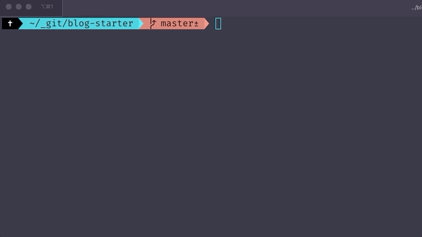

# gatsby-create-post-cli

A simple CLI for creating markdown blog posts in Gatsby.

## Installation

This needs to be installed globally to be available on the command line.

### NPM
```bash
npm install -g https://github.com/TheRealAlan/gatsby-create-post-cli
```

### Yarn
```bash
yarn global add https://github.com/TheRealAlan/gatsby-create-post-cli
```

## Usage

All that's needed is a title as a string:

```bash
gatsby-create-post "Hello World"
```



This will create a prefilled markdown file at `src/posts/hello-world/index.md`. This assumes 
your posts are inside of the `src` directory in a folder called `posts`.

```bash
├── src
│   └── posts
│       └── hello-world
│           └── index.md
```

The `title`, `date` and `path` frontmatter fields will be prefilled:

```markdown
---
title: "Hello World"
date: "2020-03-15T17:40:33.725Z"
path: "/hello-world/"
---
```

This is extremely simple and basic, and it can probably be broken easily with certain characters. 
This also includes no category or tag support. Those can be added to your post manually if you would 
like, but if you want a similar tool that's much more robust, check out [gatsby-lumen-post-cli](https://github.com/baeharam/gatsby-lumen-post-cli).
